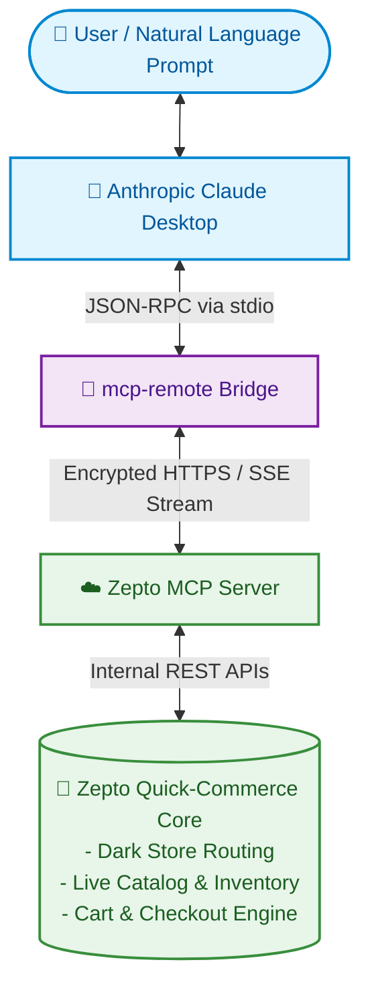
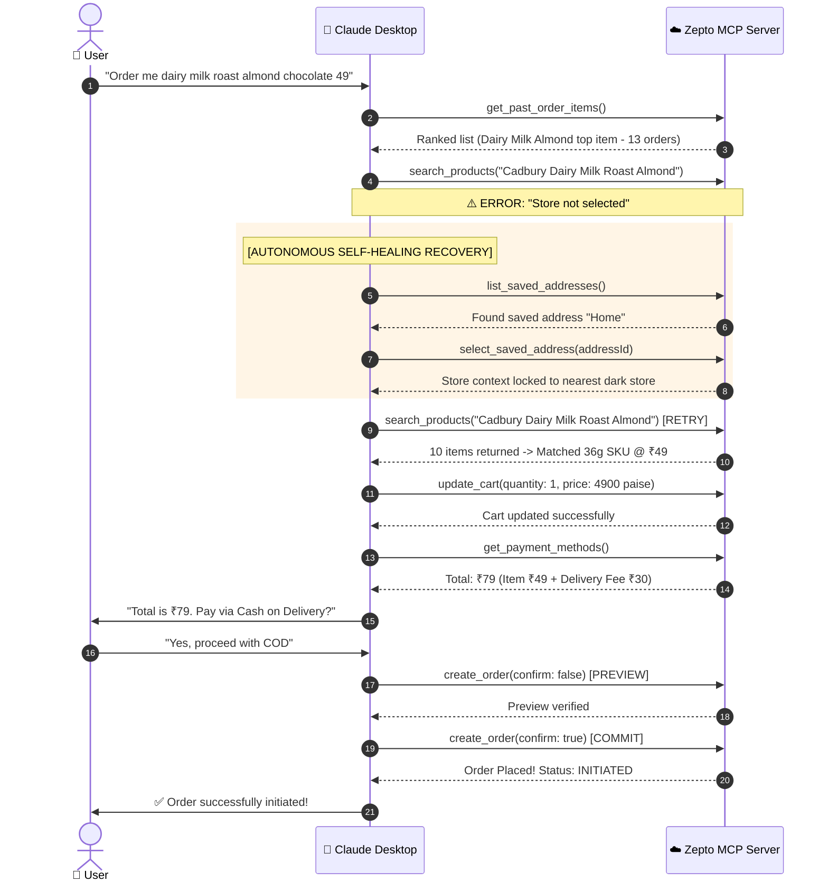

# Zepto MCP Assistant

[](https://modelcontextprotocol.io)
[](https://claude.ai)
[](https://nodejs.org)
[]()
[](LICENSE)

> ### 📌 Project Overview
> **The project is a verified implementation of Anthropic's Model Context Protocol integrating Claude Desktop with Zepto's live e-commerce platform. The workflow completed a live Cash on Delivery order of ₹79 with zero human intervention required for store routing errors.**

---

## 📖 Table of Contents
- [Executive Summary](#executive-summary)
- [System Architecture](#system-architecture)
- [Verified MCP Tool Suite](#verified-mcp-tool-suite)
- [Autonomous Error Recovery Workflow](#autonomous-error-recovery-workflow)
- [Repository Structure](#repository-structure)
- [Prerequisites](#prerequisites)
- [Quickstart & Configuration](#quickstart--configuration)
- [Live Session Walkthrough](#live-session-walkthrough)
- [Empirical Test Results](#empirical-test-results)
- [Security & Transaction Safety](#security--transaction-safety)
- [Project Documentation](#project-documentation)
- [License](#license)

---

## Executive Summary

Traditional grocery ordering requires navigating numerous user interface screens: setting addresses, searching products, comparing weights, managing carts, selecting payment methods, and reviewing fees. 

This project explores **Conversational Commerce**: enabling an LLM (Claude) to execute the complete grocery ordering journey while:
1. **Grounding Intent**: Translating loose natural language requests (e.g., *"order me dairy milk roast almond chocolate price 49"*) into verified product SKUs using historical order frequency.
2. **Autonomous Error Recovery**: Detecting API dependency failures (such as `"Store not selected"`) and self-healing by resolving saved addresses to bind the dark store.
3. **Strict Human Safeguards**: Implementing a non-destructive preview phase (`confirm: false`) followed by explicit human confirmation (`confirm: true`) to ensure zero unauthorized financial transactions occur.

---

## System Architecture

The integration bridges Claude Desktop with Zepto's live quick-commerce microservices using the open **Model Context Protocol (MCP)** standard.



---

## Verified MCP Tool Suite

The integration utilizes **8 production tools** exposed by the Zepto MCP server:

| Tool Name | Parameters | Purpose |
| :--- | :--- | :--- |
| `list_order_history` | *None* | Fetches recent orders with delivery status (`DELIVERED`, `CANCELLED`), item quantities, and order totals. |
| `get_past_order_items` | *None* | Returns unique past products ranked by purchase frequency to disambiguate loose queries. |
| `list_saved_addresses` | *None* | Retrieves user-saved delivery locations (e.g., "Home"). |
| `select_saved_address` | `addressId` | Binds the active session to a saved address, which automatically locks the serving dark store. |
| `search_products` | `query` | Searches live inventory in the selected dark store. |
| `update_cart` | `variantId`, `storeProductId`, `quantity`, `priceInPaise`, `deviceId` | Adds, modifies, or removes cart items. |
| `get_payment_methods` | *None* | Returns available payment channels (COD, Web Link, Wallet) and total charges. |
| `create_order` | `paymentMethod`, `addressId`, `confirm` *(bool)* | Two-phase checkout execution (Preview vs Final Placement). |

---

## Autonomous Error Recovery Workflow



---

## Repository Structure

```
zepto-mcp-assistant/
├── .gitignore                          # Standard ignore patterns for Node, Windows & secrets
├── LICENSE                             # MIT Open-Source License
├── package.json                        # Project metadata and diagnostic scripts
├── README.md                           # Main repository documentation
├── config/
│   └── claude_desktop_config.example.json  # Sanitized Claude Desktop configuration template
├── docs/
│   ├── ARCHITECTURE.md                 # Deep-dive system architecture & data contracts
│   ├── DEMO_SCRIPT.md                  # 6–8 minute screen recording script & timeline
│   └── PRESENTATION_DECK_NOTES.md      # 12-slide academic presentation & speaker notes
└── scripts/
    └── test_connection.bat             # One-click diagnostic script to verify server connection
```

---

## Prerequisites

* **Operating System**: Windows 10/11, macOS, or Linux.
* **Node.js**: v18.0.0 or higher (`node -v` $\ge$ 18.0; verified on Node `v24.21.0`).
* **AI Client**: [Claude Desktop](https://claude.ai/download) installed.
* **Zepto Account**: An active Zepto account with at least one saved delivery address in the mobile app.

---

## Quickstart & Configuration

### 1. Configure Claude Desktop
Open your Claude Desktop configuration file:

* **Windows**:
  ```text
  %APPDATA%\Claude\claude_desktop_config.json
  ```
  *(Or if installed via Windows Package Manager / MSIX)*:
  ```text
  %LOCALAPPDATA%\Packages\Claude_pzs8sxrjxfjjc\LocalCache\Roaming\Claude\claude_desktop_config.json
  ```
* **macOS**:
  ```text
  ~/Library/Application Support/Claude/claude_desktop_config.json
  ```

### 2. Add the Zepto MCP Server
Add the following entry under `"mcpServers"`:

```json
{
  "mcpServers": {
    "zepto": {
      "command": "cmd",
      "args": [
        "/c",
        "npx",
        "-y",
        "mcp-remote",
        "https://mcp.zepto.co.in/mcp"
      ]
    }
  }
}
```

### 3. Verify Connection
You can test the connection directly by double-clicking [`scripts/test_connection.bat`](scripts/test_connection.bat) or by running:
```powershell
npx -y mcp-remote https://mcp.zepto.co.in/mcp
```
Completely restart Claude Desktop. The hammer icon in the bottom-right corner will show the `zepto` server with 8 available tools.

---

## Empirical Test Results

| Test Scenario | Action Tested | Observed Result |
| :--- | :--- | :--- |
| **History Retrieval** | Fetch past user orders | **Passed**: 8 orders parsed and converted from paise to INR. |
| **Out-of-Scope Request** | Request to rate order | **Passed**: Handled gracefully; directed user to official app. |
| **Store Dependency** | Search catalog without location | **Passed**: Caught `"Store not selected"`, selected home address, and retried. |
| **SKU Disambiguation** | Match loose query with price | **Passed**: Correctly matched ₹49 variant (36g) against premium variants. |
| **Transaction Safeguard** | Execution without consent | **Passed**: Enforced preview and halted for human confirmation before spending. |

---

## Security & Transaction Safety

1. **Non-Destructive Previews**: Transaction endpoints require a two-stage commit (`confirm: false` followed by `confirm: true`).
2. **Human-in-the-Loop Safeguards**: The model halts before checkout to disclose item costs and delivery fees.
3. **Data Scrubbing**: No personal phone numbers, physical addresses, or active session tokens are committed to this repository.

---

## Project Documentation
* 📐 **[System Architecture & Tool Contracts](docs/ARCHITECTURE.md)**: Deep dive into JSON-RPC messages and schema definitions.
* 🎥 **[Demo Recording Script](docs/DEMO_SCRIPT.md)**: Detailed 6–8 minute screen recording script.
* 📊 **[12-Slide Presentation Outline](docs/PRESENTATION_DECK_NOTES.md)**: Complete slide-by-slide speaker notes.

---

## License
This project is open-source and available under the [MIT License](LICENSE).
