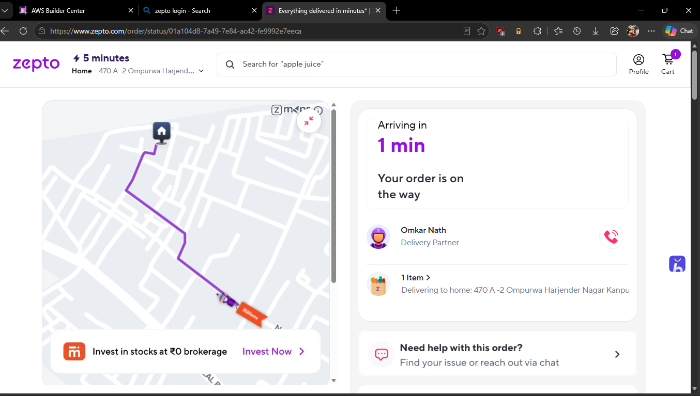
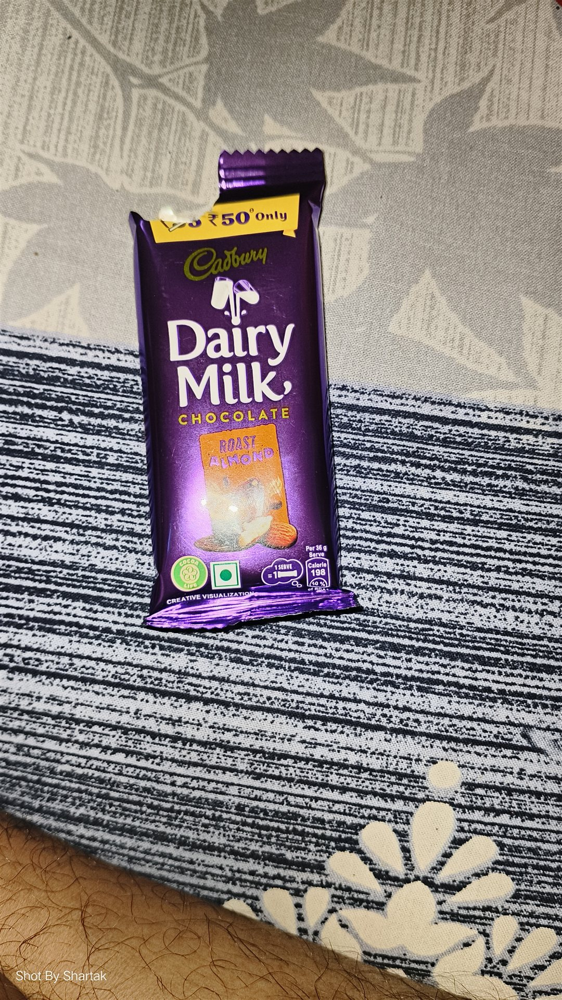

# Live Project Demo & Proof of Working Delivery

**Project**: Conversational Grocery Ordering via Zepto MCP Server & Claude Desktop  
**Presenter**: Prativesh Sharma  
**Target Duration**: 2 to 3 Minutes  
**Live Demo Recording Link**: [Watch Live Demo Recording on Google Photos](https://photos.app.goo.gl/LBj8j8BLm8uLY1UD7)

---

## 📸 Empirical Proof of Working Implementation

This project is not a simulation. It executed a **real live e-commerce transaction on Zepto's live production infrastructure**, with delivery partner dispatch and doorstep fulfillment:

| Live Order Tracking (Zepto Web) | Physical Delivered Product (Doorstep Proof) |
| :---: | :---: |
|  |  |
| **Order ID**: `01a104d8-7a49-7e84-ac42-fe9992e7eeca` **Rider**: Omkar Nath (Arriving in 1 min) | **Item**: Cadbury Dairy Milk Roast Almond (36g) **Total Paid**: ₹79 (COD) |

---

## ⚡ Concise 3-Minute Presentation Walkthrough

### 1. The Goal (0:00 – 0:30)
> *"Welcome! I integrated Claude Desktop with Zepto's live quick-commerce microservices using the Model Context Protocol (MCP). Instead of manually opening apps, navigating dark stores, and browsing dozens of variants, I can order essentials through natural conversational language with complete safety."*

### 2. Autonomous Intent & Self-Healing Execution (0:30 – 1:30)
> *"When given the prompt: **'make order to me ... dairy milk roast almond chocolate price 49'**:*
> - *Claude calls `get_past_order_items()` to ground intent, finding I previously ordered this bar 13 times.*
> - *When `search_products()` throws an error: `Store not selected`, Claude doesn't crash—it **autonomously self-heals** by calling `list_saved_addresses()`, selecting my 'Home' address, locking the nearest dark store, and retrying the search.*
> - *It automatically identifies the exact 36g ₹49 SKU and updates the cart."*

### 3. Human Safeguards & Live Delivery Proof (1:30 – 2:30)
> *"Before spending any money, Claude halts. It calls `get_payment_methods()`, discloses the full breakdown (₹49 item + ₹30 delivery = ₹79 Total), and requests confirmation.*
> - *Once approved, it performs a two-stage checkout: `create_order(confirm: false)` for preview, followed by `create_order(confirm: true)`.*
> - *The order was placed live, dispatched to delivery partner Omkar Nath, and delivered right to my doorstep as shown in the proof photos and Google Photos recording.*
> 
> *The entire code, architecture, and live demo are documented here on GitHub."*

---

## 🔗 Quick Resource Links
- 🎥 **Full Video Recording**: [Google Photos Album](https://photos.app.goo.gl/LBj8j8BLm8uLY1UD7)
- 📊 **Interactive Slide Deck**: [Google Gemini Presentation](https://share.gemini.google/2v7A0ewdICO6)
- 📐 **Architecture Specs**: [`docs/ARCHITECTURE.md`](ARCHITECTURE.md)
